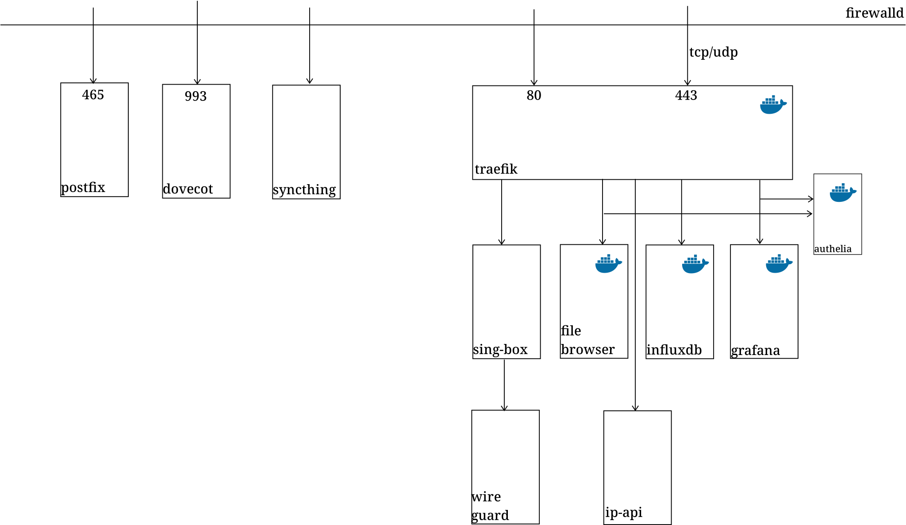
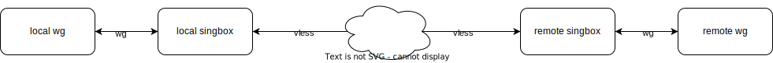

长话短说，现在我的服务器上面部署的服务：

## 安全？

安全策略是永远不嫌多的，但是作为一个懒癌，去他的安全策略！

全局考虑的安全措施：
- 防火墙。
- 对外服务必须 tls，特别的 postfix 和 dovecot 只接受外层 tls 连接。
- 到 postfix 的外部连接必须进行身份验证。

其他方面从简考虑，多数数据存储使用 sqlite 或者本地文件。
## traefik：

> _Traefik_ (pronounced traffic) is a modern HTTP reverse proxy and load balancer that makes deploying microservices easy.

为什么使用 traefik？我主要考虑 3 的特性：

|  | caddy | nginx | traefik |
| ---- | ---- | ---- | ---- |
| 自动 https | ✅ | ❌ | ✅ |
| layer 4 代理 | ⚠️[^1] | ✅ | ✅ |
| 配置发现 | ❌ | ❌ | ✅ |

除此以外，traefik 的其他不错的特性还有：
- 内置的 metric 和 dashboard。
- 简单灵活的路由规则。
- 灵活的 tls SNI and/or ALPN 路由。

## file-browser

私有网盘一般都太重了，我不需要那么多特性，大多数时候简单的 caddy file-server 就足够了，偶尔会需要从 web 上传一些文件、通过 web 编辑一下简单的 txt 文件。

file-browser 足够轻量，特性也够用。

## 监控

有时候长时间运行的服务出问题，想要看一下系统的历史状态，所以开了 influxdb、grafana。公司监控前端也都是 grafana，上班时间看起来我在调监控，其实我在摸鱼！

## wireguard

wireguard 不直接外对开放，而是只接受 singbox 隧道进来的连接，我使用的外层协议是 vless。

刚开始部署 wireguard 时，使用的直连方案。不过由于家里的电脑在层层 NAT 后面，也没有稳定的 ipv6，wireguard 保持长连接一段时间后，应该是被运营商进行了严重 QoS 限制，几乎不可用。使用隧道以后情况改善很多。

## syncthing

这是一个文件同步服务，用于将几个小的重要的或者需要频繁改动、跨设备查看的文件同步到服务器上，基本在搭配 file-browser 使用。

## postfix & dovecot

完整的邮件服务。虽然部署了 dovecot，不过这个只用来给 postfix 提供身份验证服务，外加将本地邮件通过互联网暴露给标准的 imap 客户端。

smtp 服务主要给 authelia 使用。另外偶尔跑一些长时间运行的服务，拿来给自己发送通知是比较稳定的方案。(自用 fcm android 接受器~~唂咕~~、重写中)

可以随便自定义的邮件地址注册小号也挺有用，但我对这垃圾服务商的稳定性可不自信，目前正在使用的方案是 cloudflare 的邮件 routing 服务。

## 「2023，」

年初从老家返校，玩了几个月，把学校各种破事应付完，然后到了上海。入职前缩在出租屋，想着马上就开始的社畜生活，即使都是自己选的(至少，看起来是有得选)，那几天的消极，真不想再体验。

然后就是半年的社畜生活哩，NOC 运维的生活，诶，一言难尽。

一同入职的小伙伴 2 个月(至少，从我掌握的信息看)自己离职了，2 个月，看着小伙伴从一个阳光开朗男大学生，一点点变得沉默寡言，最后说话声音都带着沙哑。虽然实习的时候，同样也是很大压力，也不是完全不能理解，但是从旁观者的角度看，属实也是被震撼到了。

刚入职不多久的时候，同事说他有学弟秋招想要投一投 NOC，想要问一问我的感受。说了半天，我也没能给出点优点，最后想了想，以「言已至此」做结束。

如果不需要考虑未来，现在的工作状态还是挺令人满意的。不过就算是对于短期主义如我来说，那个不需要考虑的时间点也实在有点太近了。

脑子里想法一大把，实际上都执行不了或者执行不下来。短期也确实大概率不会面临断粮风险加上日夜翻班，做事情提不起精神来。漫漫长夜折腾服务器时最能获得短时间平静，这也是有这个短文的原因。

2023 的最后一天，如果是以前的我，很难想象我居然这么有仪式感，特地在这一天丢个这种博客上来。2024 希望能更「活」一点点。

[^1]: 社区维护
