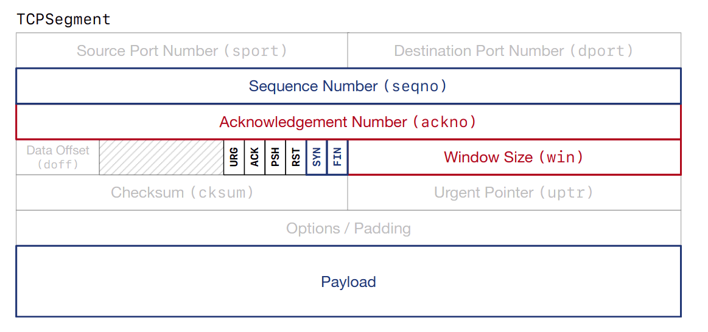

## 引言

本文主要记录在完成 [cs144](https://cs144.github.io/) 课程 Lab 的过程中遇到的问题。

## 开始之前

我主要在自己日常使用的机器上完成 Lab，GCC 大版本为 12，sponge 无法直接通过编译。这是因为一部分头文件在 GCC12 下需要显式包含才能使用，比如 `libsponge/util/address.cc` 需要显式包含 `array`，更多参考 [Porting to GCC 12](https://gcc.gnu.org/gcc-12/porting_to.html#:~:text=Header%20dependency%20changes)。

## Lab4 部分翻译。

注意，这里不是 Lab4 的全文翻译。此处包含了 Lab4 要求的大部分点，但更建议搭配原文使用。

### 3 Lab 4: The TCP connection

此 lab 中，你要做的主要是把 sender 和 receiver 组合起来，维护一些全局状态。

TCPConnection 负责发送和接受片段（segment），确保提醒 sender 和 receiver 去修改接受的片段和发送的片段中，他们需要关心的字段。

TCPConnection 需要遵守的基本规则：

接受片段：`segment_received` 被调用时，TCPConnection 从网络接收到片段。此时，TCPConnection 检查片段并且：

- 如果存在 `RST` 标志，使输入流和输出流进入错误状态，永久杀死这个连接。否则...
- 将片段交给 TCPReceiver，使其可以检查它关心的接受到的字段：`seqno`，`SYN`，`payload`，`FIN`。
- 如果存在 `ACK` 标志，告知 TCPSender 它关心的输入片段的字段：`ackno`，`window_size`。
- 如果输入片段占用任何序列号，TCPConnection 确保回复中至少有一个片段（原文：the TCPConnection makes
sure that at least one segment is sent in reply）指出 `ackno` 和 `window_size` 的更新。
- TCPConnection 的 `segment_received()` 方法中，你需要额外处理一种特殊情况：回复 "keep-alive" 片段。对方为了检测你的 TCP 实现是否活着，可能会发送一个带有不合法序列号的片段。即使他们并不占用序列号，你的 TCPConnection 也应当回复这些 "keep-alives"。可能的代码实现：
  ```c++
  if (_receiver.ackno().has_value() and (seg.length_in_sequence_space() == 0)
      and seg.header().seqno == _receiver.ackno().value() - 1) {
      _sender.send_empty_segment();
  }
  ```

发送片段：TCPConnection 会通过网络发送 TCPSegment：
- 任一时刻，当TCPSender 将一个片段放入它的发送队列，设置了它负责的字段后。
- 发送片段之前，TCPConnection 向 TCPReceiver 询问它负责的发送片段中的字段：`ackno` 和 `window_size`。如果有 `ackno`，TCPConnection 会在 TCPSegment 中设置 `ACK` 标志。

TCPConnection 有一个 `tick` 方法，此方法会被 OS 随着时间流逝调用。当此方法被调用时，TCPConnection 需要：
- 告知 TCPSender 关于经过的时间。
- 如果连续重传的次数大于 `TCPConfig::MAX RETX ATTEMPTS`，终止(abort)连接。
- 如果有需要，干净地结束(end)连接。

下图是 TCPSegment 整体结构，sender 和 receiver 负责的字段有着不同颜色。



TCPConnection 的完整接口在[类文档](https://cs144.github.io/doc/lab4/class_t_c_p_connection.html)中。尽量将复杂的逻辑推到 sender 和 receiver 的实现中去。最难的部分会是决定何时完全终止一个 TCPConnection 并且声明它不再活跃(active)。

### 4 FAQs 和特殊情况

- 期望的代码行数

  整体来说，我们期望 tcp_connection.cc 中一共有大约 100-150 行代码。
- 从哪开始？

  可能最好的方式是，一开始，将一些 "普通的" 方法串联到合适的 TCPSender 和 TCPReceiver 的调用。这些方法包括 `remaining_outbound_capacity()`，`bytes_in_flight()`，`unassembled_bytes()`。
  
  然后实现 "writer" 方法：`connect()`，`write()`，`end_input_stream()`。一些方法可能需要操作 `outbound ByteStream` 并且告知 TCPSender。

  你可以在完全实现每个方法之前开始运行测试(`make check`)。参考失败信息继续后面的工作。
- 应用程序如何从输入流中读数据？

  `TCPConnection::inbound_stream()` 已经被实现了，你什么都不用做。
- TCPConnection 需要黑魔法数据结构或算法吗？

  No。这里的工作主要是将所有东西串起来，处理一些不容易在 sender 和 receiver 中实现的逻辑。
- TCPConnection 如何真正地发送一个片段？

  将片段推入 `_segments_out` 队列。
- TCPConnection 如何感知时间？

  `tick()` 方法会被周期性的调用，不要使用其他方法。
- 如果一个接收到的片段有 `RST` 标志，TCPConnection 应当如何处理？
  
  "reset" 标志意味着此连接立刻死亡。如果你收到了有 `RST` 标志的片段，你应当设置 `inbound/outbound ByteStream` 的错误标志，并且任意后续的对 `TCPConnection::active()` 的调用应当返回 `false`。
- 什么情况下，我应当发送带有 `RST` 标志的而片段？

  1. 太多次连续重传。

  2. 连接依旧活跃「`active()` 返回 `true`」的情况下，TCPConnection 的析构函数被调用。

  发送一个带有 `RST` 的片段和接收一个有类似的效果。

- 如何构造一个带有 `RST` 标志的片段？序列号是什么？

  通过调用 `send_empty_segment()` 强制 TCPSender 生成一个有合适序列号的空片段。或者调用 `fill_window()` 方法。
- 为什么需要 `ACK` 标志。

  **几乎** 每个 TCPSegment 都有 `ackno` 和 `ACK` 标志。

  对于发送的片段，只要可能，你就设置 `ackno` 和 `ACK` 标志。「只要可能」意味着 TCPReceiver 的 `ackno()` 存在值。

  对于接收的片段，只有存在 `ACK` 标志，你才需要检查 `ackno`，并将 `ackno`(和 window size) 告知 TCPSender。
- 如何解读 "state" 名字("stream started","stream ongoing")？

  参考 Lab2 和 Lab3 的材料。
- 如果 TCPReceiver 声明一个 `TCPSegment::header().win` 放不下的窗口大小，我该如何处理？

  发送可以发送的最大的值。

### 5 TCP connection 的终止：共识很重要

TCPConnection 的一个重要的功能是决定何时 TCP connection 完全结束("done")。完全结束时，实现释放本地端口，停止发送确认片段，认为连接已经结束，确保 `active()` 方法返回 `false`。

存在两种可以终止一个连接的方法。在 **unclean shutdown** 中，TCPConnection 要么发送要么接收一个带有 `RST` 标志的片段。这种情况，输入输出流都应当进入 `error` 状态，`active()` 立刻返回 `false`。

在 「clean shutdown」 中，我们不产生任何错误到达 `active() = false` 状态。

为了干净地关闭一个连接，有以下四个前提条件：

1. 输入流被全部组装并且到达了 eof。
2. 本地程序结束了输出流并且输出流已被全部发送。
3. 远端完全确认了输出流。
4. 本地 TCPConnectin 确信远端满足条件3。

#### 5.1 TCP connection 的终止：对真实实践的总结

维护一个 `_linger_after_streams_finish` 变量，通过 `state()` 方法暴露出去。这个变量初始化为 `true`。如果输入流在 TCPConnection 的输出流到达 EOF 之前结束，将其设置为 `false`。

任意时刻，当前提条件 1 到 3 全部满足。
- 如果 `_linger_after_streams_finish` 为 `false`，连接进入终止状态(`active()` 返回 `false`)。
- 否则，你需要等一会(linger)：自从上次接收到片段又经过足够多时间(10 倍 `_cfg.rt_timeout`)后终止。
