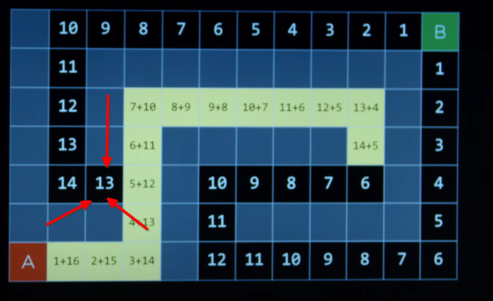
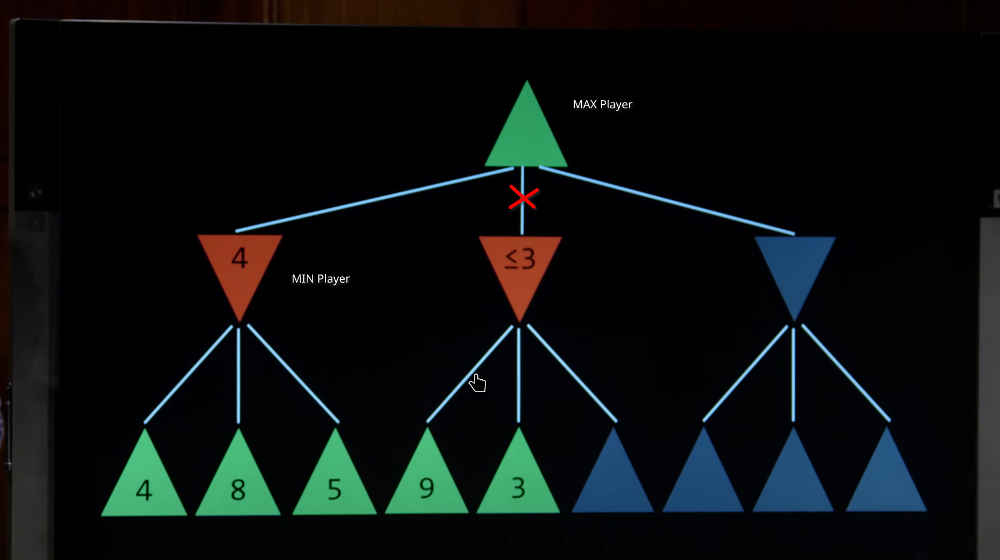
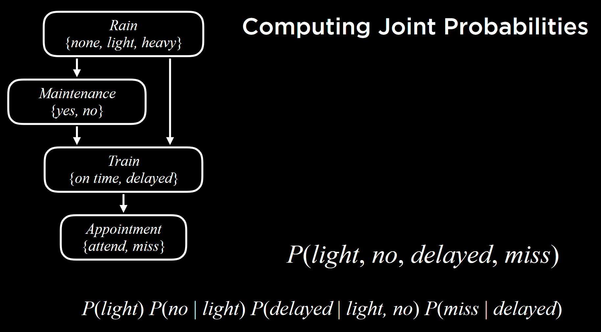
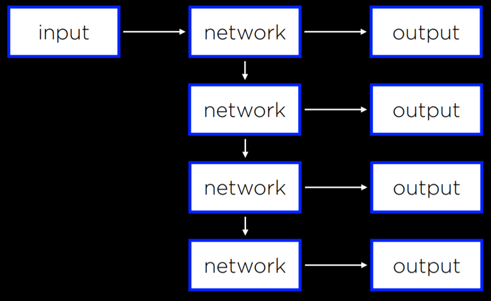

<!--more-->


## Search

熟悉的话题，不过依然让人回忆起一个容易忽视的点：使用 stack 进行迭代式 dfs。

### GBFS

使用启发函数 heuristic h(s)

### A*

同时考虑到达某个状态的花费 g(s) 和启发函数 h(s)。

下面的图举例了一个 A* 和 GBFS 的不同：

当已经访问过亮色的位置后，A* 总是选择 h(s) = 13 的位置作为下一个访问的位置。

当满足：
1. heuristic 函数从不高估代价
2. heuristic 函数具有一致性（对任意 $n \xrightarrow{cost:c} n'$ ，$h(n) <= h(n') + c$）
时，A* 给出最优解。

### alpha beta 剪枝




## Knowledge

### Project: minesweeper

测试数据在 https://github.com/ai50/projects 的对应分支。

minesweeper 中 Sentence 的 spec 没有很准确的规定一些细节，可以结合测试数据去写。

最主要的部分是 `MinesweeperAI。add_knowledge`，根据注释

```python
'''
This function should:

1) mark the cell as a move that has been made

2) mark the cell as safe

3) add a new sentence to the AI's knowledge base based on the value of `cell` and `count`

4) mark any additional cells as safe or as mines if it can be concluded based on the AI's knowledge base

5) add any new sentences to the AI's knowledge base if they can be inferred from existing knowledge
'''
```

其中，简单实现： 4) 和 5) 不断循环直到得不到新的推论。

##  Uncertainty

### 几个 rule：

**条件概率**(conditional probability)：

$$
P(AB) = P(A)P(B|A)=P(B)P(A|B)
$$

AB 同时发生：A 发生；已知 A 发生，B发生，两者乘积。

变形得到贝叶斯定律：

$$
P(B|A)=\frac{P(B)P(A|B)}{P(A)}
$$

**Marginalization**:

$$
P(A) = P(A,B) + P(A, \neg B)
$$

**conditioning**:

$$
P(A) = P(A|B)P(B) + P(A|\neg B)P(\neg B)
$$

### Project: Bayesian network

Wikimedia：https://zh.wikipedia.org/wiki/%E8%B2%9D%E6%B0%8F%E7%B6%B2%E8%B7%AF

简单理解：互相影响的随机变量的 DAG，有向边 $u \to v$ 表示 $v$ 受 $u$ 影响。

网络中的边刻画了随机变量见的依赖，下面是网络中计算联合概率的一个例子：


### project heredity

数学苦手开始掉头发了💔。虽然 project 完成的「还算顺利」，不过研究 spec 花了很久，中间对 `joint_probability` 理解出错显然暴露了咱对 lecture 中这一部分理解有问题，但是咱有什么办法，咱也知道自己迷迷糊糊的😵。

回到 proj，实际上，这个 proj 做的事情就是实现一个 Notes 中的 [Inference by Enumeration](https://cs50.harvard.edu/ai/2024/notes/2/)。为了理解 heredity.py，先关注下这几个问题：

#### `joint_probability` 的实现。

已知全部的名字，以及每个人有几个目标基因以及每个人是否表现出症状，我们要算的是这些事情全部同时发生的概率。

反思自己，我觉得自己最大的问题是依然没有把事件间接的影响给排除掉，再标记下 Notes 中的一段原文：**This point about Bayesian network is noteworthy: parents include only direct relations.** 在考虑事件之间的影响时，只考虑直接影响！

令返回值 r 的初始值为 1，那么数据中没有记录父母的人，按照要求使用 PROBS 中的数据计算概率，乘入 r 中即这些人对 r 的贡献。那么在贝叶斯网络中向下一层，前面那些人的子女，他们对 r 的贡献即：在父母符合参数描述的条件下，他们符合参数中描述的状态的概率。这些概率只需要按照父母的情况，简单乘法计算即可。之后继续在网络中向下，同理。

虽然这里的思考过程是按照图有向边的顺序进行的，但是计算每个人对 r 的贡献依赖的父母的情况是作为条件已知的，计算并不需要按照特定顺序。

```python
def joint_probability(
    people: dict[str, dict[Literal["mother", "father"], str | None]],
    one_gene: set[str],
    two_genes: set[str],
    have_trait: set[str],
):
    """
    Compute and return a joint probability.

    The probability returned should be the probability that
        * everyone in set `one_gene` has one copy of the gene, and
        * everyone in set `two_genes` has two copies of the gene, and
        * everyone not in `one_gene` or `two_gene` does not have the gene, and
        * everyone in set `have_trait` has the trait, and
        * everyone not in set` have_trait` does not have the trait.
    """
    def p_get_from(n: Literal[0, 1], n_parent: Literal[0, 1, 2]):
        '''
        probability of get n genes from one parent of n_parent genes
        '''
        m, nm = PROBS["mutation"], 1 - PROBS["mutation"]
        table = {
            0: {
                0: nm, # parent 0 gene, so as long as no mutation we got 0
                1: 0.5, # = 0.5*nm + 0.5*m
                2: m,
            },
            1: {
                0: m,
                1: 0.5,
                2: nm,
            },
        }

        assert n in [0, 1] and n_parent in [0, 1, 2]
        return table[n][n_parent]

    j_prob = 1
    for name in people.keys():
        ng_of = lambda name: 1 if name in one_gene else 2 if name in two_genes else 0

        if people[name]["mother"] == None and people[name]["father"] == None:
            j_prob *= PROBS["gene"][ng_of(name)]
        elif people[name]["mother"] != None and people[name]["father"] != None:
            this_ng = ng_of(name)
            mng = ng_of(people[name]["mother"])
            fng = ng_of(people[name]["father"])

            if this_ng == 0:
                j_prob *= p_get_from(0, mng) * p_get_from(0, fng)
            elif this_ng == 1:
                j_prob *= p_get_from(1, mng) * p_get_from(
                    0, fng
                ) + p_get_from(0, mng) * p_get_from(1, fng)
            else:
                j_prob *= p_get_from(1, mng) * p_get_from(1, fng)
        else:
            raise "invalid data: one of father and mother is None"

        is_have_trait = name in have_trait
        j_prob *= PROBS["trait"][ng_of(name)][is_have_trait]

    return j_prob
```

#### main 的实现

main 主要部分就是计算

$$
P(X|e) = \alpha P(X,e) = \alpha \sum_{y}P(X,e,y)
$$

的逻辑。三个 for 不仅是在遍历 $y$，也是在遍历 $X$，后面 `update` 中的 for，可以认为是在遍历结果中划分 $X$ 和 $y$，划分完成后计算那一次遍历对应的每个人的情况对每种 $X$ 的贡献。

## Optimization

### Hill Climbing

可以使用多种选择更优的相邻值的策略。

### Simulated Annealing、Linear Programming

### Constraint Satisfaction problems

-  A **Hard Constraint** is a constraint that must be satisfied in a correct solution.
- A **Soft Constraint** is a constraint that expresses which solution is preferred over others.
- A **Unary Constraint** is a constraint that involves only one variable. In our example, a unary constraint would be saying that course A can’t have an exam on Monday {_A ≠ Monday_}.
- A **Binary Constraint** is a constraint that involves two variables. This is the type of constraint that we used in the example above, saying that some two courses can’t have the same value {_A ≠ B_}.

#### Node consistency

Node consistency is when all the values in a variable’s domain satisfy the variable’s unary constraints.

#### Arc Consistency

Arc consistency is when all the values in a variable’s domain satisfy the variable’s binary constraints (note that we are now using “arc” to refer to what we previously referred to as “edge”).

## Machine Learning

Machine learning provides a computer with data, rather than explicit instructions. Using these data, the computer learns to recognize patterns and becomes able to execute tasks on its own.

### Supervised learning

**Supervised learning** is a task where a computer learns a function that maps inputs to outputs based on a dataset of input-output pairs.

There are multiple tasks under supervised learning, and one of those is **Classification**: Nearest-Neighbor Classification, Perceptron Learning, Support Vector Machines.

**Regression** is a supervised learning task of a function that maps an input point to a continuous value, some real number. This differs from classification in that classification problems map an input to discrete values.

**Regularization** is the process of penalizing hypotheses that are more complex to favor simpler, more general hypotheses. We use regularization to avoid **overfitting**.

In regularization, we estimate the cost of the hypothesis function h by adding up its loss and a measure of its complexity.

_cost_(h) = _loss_(h) + λ_complexity_(h)

**Reinforcement learning** is another approach to machine learning, where after each action, the agent gets feedback in the form of reward or punishment (a positive or a negative numerical value).

Reinforcement learning can be viewed as a Markov decision process, having the following properties:
- Set of states **_S_**
- Set of actions **_Actions(S)_**
- Transition model **_P(s’ | s, a)_**
- Reward function **_R(s, a, s’)_**

**Q-Learning** is one model of reinforcement learning, where a function **_Q(s, a)_** outputs an estimate of the value of taking action _a_ in state _s_.

### Unsupervised Learning

In supervised learning, we had data with labels that the algorithm could learn from. In unsupervised learning, only the input data is present and the AI learns patterns in these data.

**Clustering** is an unsupervised learning task that takes the input data and organizes it into groups such that similar objects end up in the same group.

## Neural Networks

**A** neural network: a function sums up inputs to produce an output. Example: inputs $x_1, x_2$, with some weights and a bias: $w_0, w_1, w_2$ and a activation function $g$. We got an output: $g(w_0+w_1x_1+w_2x_2)$.

> quiz: How many total weights (including biases) will there be for a fully connected neural network with a single input layer with 3 units, a single hidden layer with 5 units, and a single output layer with 4 units?
>
> Each unit of 5 hidden layer units need 3 + 1(bias) weights.
> Each unit of 4 output layer units need 5 + 1(bias) weights.
> Total:
> $5 \times (3+1) + 4 \times (5+1) = 20 + 24 = 44$

**deep neural networks**: neural networks that have more than one hidden layer.

A **convolutional neural network** is a neural network that uses convolution, usually for analyzing images.

As opposed to those **Feed-Forward Neural Networks** where input data is provided to the network, which eventually produces some output, **Recurrent Neural Networks** consist of a non-linear structure, where the network uses its own output as input.

Feed-Forward Neural Network:


RNN:


### Project

不使用 GPU 的话 tensorflow 基本是开箱即用的，但是全程用 CPU 训练模型的效率实在是有点差，刚好我手边反正有块 40 系显卡，不过 Arch 下配置这个运行环境还是有点烦的啊。

Archwiki 的 GPGPU 条目介绍了 cuda 相关的包，但是按照上面的说明做完之后，运行 tensorflow 的测试，被提示
```plaintext
Cannot dlopen some GPU libraries. Please make sure the missing libraries mentioned above are installed properly if you would like to use GPU. Follow the guide at [https://www.tensorflow.org/install/gpu](https://www.tensorflow.org/install/gpu) for how to download and setup the required libraries for your platform.
Skipping registering GPU devices...
```
错误信息提示 「make sure the missing libraries mentioned above are installed properly」，但是从上文并没有看到有提示什么库缺失的信息。通过 `export LD_DEBUG=libs` 检查可以知道 tensorflow 尝试打开 libcudnn 版本 8，但是在确保系统最新的情况下，cudnn 已经在版本 9 了，从而导致了上面的失败。

tensorflow 官网有另一种安装方式：docker。我这里使用 podman 作为容器实现，首先依照 [Installing the NVIDIA Container Toolkit](https://docs.nvidia.com/datacenter/cloud-native/container-toolkit/latest/install-guide.html#installing-the-nvidia-container-toolkit "Permalink to this headline") 安装 NVIDIA Container Toolkit，然后[配置 CDI](https://docs.nvidia.com/datacenter/cloud-native/container-toolkit/latest/cdi-support.html)，最后 pull、run 完事。便利！

```shell
podman pull docker.io/tensorflow/tensorflow:latest-gpu
podman run --gpus all -dit tensorflow/tensorflow:latest-gpu bash
```
